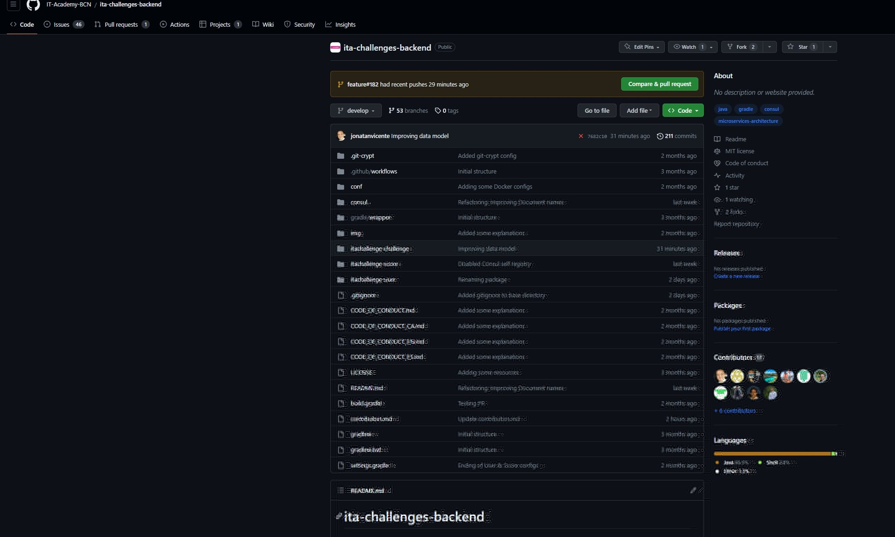
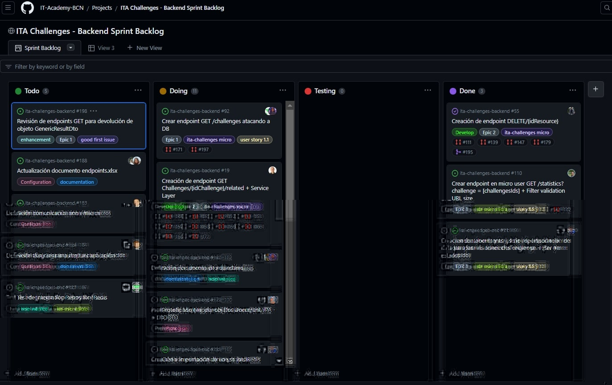
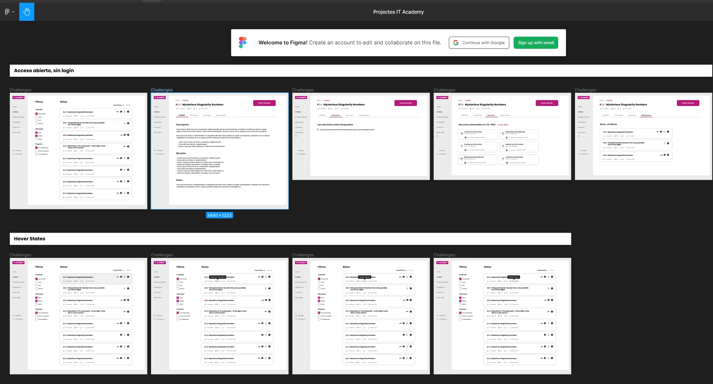
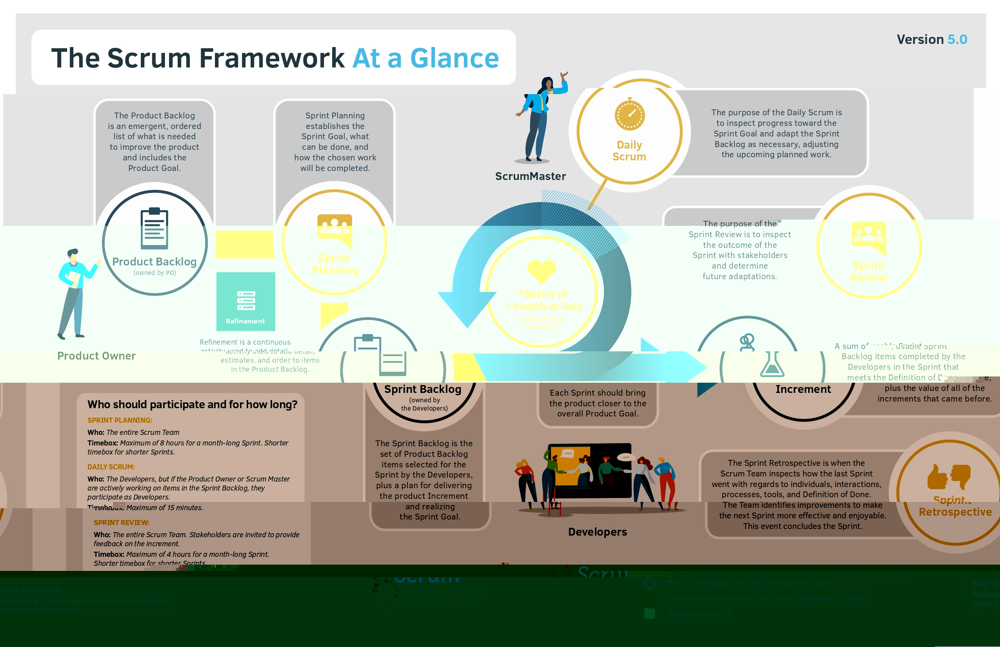

# IT-Challenge Style Guide

## Table of Contents

1. [**PROJECT'S LINKS**](#1-project-links)\
   1.1 [Project's Links](#11-project-links) 

2. [**WORK PROCEDURES**](#2-work-procedures)\
   2.1 [First things to do in the project](#21-first-things-to-do-in-the-project)\
   2.2 [Git configurations](#22-git-configurations)\
   2.2.1 [Git ignore](#221-git-ignore)\
   2.2.2 [Autocrlf](#222-autocrlf)\
   2.3 [Daily Procedure](#23-daily-procedure)\
   2.4 [Work with cards Procedure](#24-work-with-cards-procedure)\
   2.5 [Points to consider when doing a PR](#25-points-to-consider-when-doing-a-pr)\
   2.6 [Scrum metodology](#26-scrum-metodology)

3. [**URL NORMALIZATION**](#3-url-normalization)\
   3.1 [Conventions](#31-conventions)

4. [**DEFINITIONS OF METHOD, CLASS, ETC...**](#4-definitions-of-method,-class,-etc---)\
   4.1 [Package names](#41-package-names)\
   4.2 [Class names](#42-class-names)\
   4.2.1 [Test Class names](#421-test-class-names)\
   4.2.2 [Interface Class names](#422-interface-class-names)\
   4.3 [Method names](#43-method-names)\
   4.3.1 [Test Method names](#431-test-method-names)\
   4.4 [Constant names](#44-constant-names)\
   4.5 [Local variable names](#45-local-variable-names)\
   4.5.1 [Temporary "throwaway" variables](#451-temporary--throwaway--variables)\
   4.6 [Type variable names](#46-type-variable-names)\
   4.7 [Camel case: defined](#47-camel-case--defined)  
   
5. [**LIBRARIES USED**](#5-libraries-used)\
   5.1 [Main Plugins](#51-main-plugins)\
   5.2 [Implementation area](#52-implementation-area)\
   5.3 [Testimplementation area](#53-testimplementation-area)

6. [**REQUIRED PROGRAMS**](#6-required-programs)\
   6.1 [Requierd programs](#61-required-programs)

7. [**RECOMMENDED PROGRAMS**](#7-recommended-programs)\
   7.1 [Recommended programs](#71-recommended-programs)

----------------------------------------------------------------

# 1. PROJECT LINKS
## 1.1 Project links
- GITHUB [link](https://github.com/IT-Academy-BCN/ita-challenges-backend)\

- Backend Sprint Backlog [link](https://github.com/orgs/IT-Academy-BCN/projects/15/views/1)\

- Product Backlog [link](https://github.com/orgs/IT-Academy-BCN/projects/13/views/1?visibleFields=%5B%22Title%22%2C%22Assignees%22%2C%22Status%22%2C%22Labels%22%5D)\

- Figma [link](https://www.figma.com/file/ScWpDKxEB3wEGbztXMSJO3/Projectes-IT-Academy?type=design&node-id=559-2230&mode=design)\

----------------------------------------------------------------

# 2. WORK PROCEDURES

## 2.1 First things to do in the project
### 1. Add your name and GitHub to the  contributors.md file

1. Clone the ita-challenges-backend repository from GitHub to your local system:

         git clone https://github.com/IT-Academy-BCN/ita-challenges-backend.git
2. Change to the cloned repository directory:

         cd ita-challenges-backend
3. Make sure you are on the "develop" branch. You can check the available branches and your current branch by executing the following command:

         git branch
4. If you aren't on the "develop", switch to it by executing the following command:

         git checkout develop
5. Create a new branch with your name to make a changes:

         git checkout -b branch-name
   Remplace "branch-name"  with a descriptive name indicating  the changes you plan to make

6. Open the "contributors.mdf" file and add your name and your GitHub.

7. After doing a git add and git commit, do the following git push:

         git push origin nombre-de-su-rama
8. Open the GitHub repository in GitHub and you should see a message that allows you to create a "pull request" from yout newly created branch to the "develop" branch. Click the link to create the pull request.

----------------------------------------------------------------
----------------------------------------------------------------
### 2. Import data into MongoDB (Example for micro itachallenge-challenge data)

1. Make sure you have the MongoDB Tools installed. If you don't already have them, go the "Required programs" section and folow the instructions provided to download them to your operting system.

2. Now that you have the MongoDB Tools installed, open the MongoDB terminal by running the following command:

         mongosh

3. Use the following command to create the data base "challenges":

         use challenges

4. Once inside the "challenge" database, paste the following code block:

         db.createUser({
         user: "admin_challenge",
         pwd: "BYBcMJEEWw5egRUo",
         roles: [
         { role: "dbOwner", db: "challenges" }
         ]
         });
   
5. Execute the following command to see if the user has been created successfully:

         show users
6. Exit the MongoDB terminal by typing the following command:

         exit

7. Move the "load-data" file from folder mongodb.init to folder "mongodb-test-data".
   If you are use Windows, use the '.bat' file, while if you are using Mac or Linux, the file '.sh'.
   
8. In the normal terminal, navigate to the mongodb-test-data folder using the 'cd' command.

9. To import the document, execut the following command:

   · Windows:

         load-data.bat

   · Mac o Linux:

         ./load-data.sh

   if you receive a permission denied message, grant execute permission to the file with the following command:

         chmod +x load-data.sh

10. Then, move the "load-data.bat" or "load-data.sh" file back to its original folder, "mongodb.init".

11. Open Mongodb Compass, do a "Reload data" and will see the data base correctly imported.

----------------------------------------------------------------
----------------------------------------------------------------
## 2.2 Git configurations

Necessary Git configurations to prevent problems

### 2.2.1 Git ignore
1. Copy file ".gitignore" from root project\
   
2. Paste it in the PC directory (outside of project folder)
3. In Git Bash...
4. Run the command: 'git config --global core.excludesfile C:\\temp\\.gitignore'\
Where...\
'C:\\temp': is the path of the folder where the ".gitignore" file is located.\
Note! This configuration will not only serve for the current project, but also for all the projects you do with GIT.

### 2.2.2 Autocrlf
If you have a problem with a PR that modify a lot of files, >100, you need do next...
1. In Git Bash...
2. Run the command: 'git config --global core.autocrlf true'

----------------------------------------------------------------
----------------------------------------------------------------
## 2.3 Daily Procedure
1. Connect to Teams at 9h15
2. Make pull the "develop" branch
3. Merge "develop" with the branc you are working on
4. Coffee time at the 10h15 approx.

IMPORTANT: It's expected that in the project we will be online with the camera on from 9h15 to 13h15, to work as a team (execpt for circumstance that justify it).

----------------------------------------------------------------
----------------------------------------------------------------
## 2.4 Work with cards Procedure
### How to assign a card
1. Sign in, on the your Github account.
2. On the "Spring Backlog" dashboard, locate the card you want to assign to yourself.
2. Click on the card to open it and see more details.
3. On the right hand side, in the "Assigness" field, if you click on "Add assigness" a drop-down list opens with all the participants of the project and you can select yourself to be assigned.
4. Once you have been assigned the card, you user profile will be displayed as the person responsible for the card.

### Column system to organize and visualize the progress of the cards
1. You can assign any card that is in the "Todo" column as long as it is free..
2. When you start working with the card, you should move it to the "Doing" column.
3. When the card task has been completed and you have PR'd it to the "develop" branch, you can move the card to the "Testing" column to indicate that it is ready to be tested.
4. Finally, when your PR has been accepted and, therefore, the card has passed testing, it will be moved to the "Done" column. This indicates that the card has been successfully completed.

### I already have a card assigned. Now what do I do?
1. Open your terminal or command line and navigate to your project's directory. Make sure you are in the "develop" branch.

2. Create a new branch using the format "feature#cardnumber". This refers to the Spring Backlog card number. For example:

         git checkout -b feature#123
3. Now you can start making changes to your branch.

4. Once you have made the necessary modifications push your branch to the remote repository. If we were in feature#123 we should do:   

         git push origin feature#123

5. Finally, go to GitHub where your repository is located and create a pull request from your "feature#123" branch to the "develop" branch.

----------------------------------------------------------------
----------------------------------------------------------------
## 2.5 Points to consider when doing a PR
1. On the pull request creation page, select the base branch and the compared branch:
   - The base branch is the branch you want to merge your changes to. In this case it is the "develop" branch.
   - The compared branch is the branch that contains your changes.
2. Provide a description of the changes you have made. Be clear and concise.
3. When you have finished completing the pull request information, click the green "Create pull request" button to create the pull request.
4. You will then see an analysis of the build. If the analysis passes successfully, a green tick will be shown in the result. On the contrary, if it detects problems in the code, a red cross will be shown. In this case, click on "Details" and see where the problem is.
5. SonarCloud will also analyze your code. It will provide you with information about bugs, vulnerabilities, security hotspots and code smell. The converage must be equal or higher than 80.0%.
6. In case you need to review and fix some problems, update your local branch with the changes and push back to the corresponding remote branch.
7. The pull request will be automatically updated with the new changes made to your branch.

----------------------------------------------------------------
----------------------------------------------------------------
## 2.6 Scrum metodology
https://scrumguides.org/

----------------------------------------------------------------

# 3. URL NORMALIZATION
In this project, it is important to follow certain conventions when establishing the structure and nomenclature of the URL's used in the backend.

## 3.1 Conventions

The following are the conventions to be followed when normalizing URLs:

- **Pluralization**: It is recommended to use plural names for resources in URL's. For example, instead of "/challenge", "/challenges" would be used.

- **Use of nouns**: Nouns should be used instead of verbs in resource names to maintain a consistent structure. For example, "/challenges" instead of "/get-challenges".

- **Separators**: The use of hyphens ("-") as a separator for words in URLs has been established. For example, "/bcn-zones."

- **Consistency in lowercase**: URL's must follow a lowercase convention. For example, "/challenges" in lowercase instead of "/Challenges" or "/CHALLENGES".

- **Avoid special characters**: Avoid special characters in URLs and use alphanumeric characters instead.

- **Versioned**: If versioning of the API is required, consider including the version in the URL. For example, "/itachallenge/api/v1/challenge" for version 1 of the challenges API.

- **Versioned**: If versioning of the API is required, consider including the version in the URL. For example, "/itachallenge/api/v1/challenge" for version 1 of the challenges API.

- **Avoid verbs in URLs**: In general, it is recommended to avoid including verbs in URLs and use the appropriate HTTP methods to perform actions on resources.

- **Consistency with attribute names**: The attribute names used in URLs should be consistent with the names used in the data model.

- **Avoid excessively long URLs**: Avoid using excessively long URLs and try to keep them concise and meaningful.

## Examples

Here are example of how URL's should be strucutrued according to esablished conventions:

- `/challenges` - Get a list of all challenges.
- `/challenges/{challengeId}` - Get the details of the challenges with ID 550e8400-e29b-41d4-a716-446655440000.
- `/challenges/{challengeId}/update` - Edit challenge details with ID 550e8400-e29b-41d4-a716-446655440000.

----------------------------------------------------------------

# 4. DEFINITIONS OF METHOD, CLASS, ETC...

## 4.1 Package names
#### RULES
    - All in Lowercase
    - Only letters & digits

#### EXEMPLE
    - com.itachallenge.user
    - exception
    - helper

### LINKS
[Oracle Code Conventions for java: 9 - Naming Conventions](https://www.oracle.com/java/technologies/javase/codeconventions-namingconventions.html)\
[Google Java Style Guide: 5.2.1 package names](https://google.github.io/styleguide/javaguide.html#s5.2.1-package-names)

----------------------------------------------------------------
----------------------------------------------------------------
## 4.2 Class names
#### RULES
    - UpperCamelCase
    - Only letters & digits

#### EXEMPLE
    - UserController
    - PropertiesConfig

#### LINKS
[Oracle Code Conventions for java: 9 - Naming Conventions](https://www.oracle.com/java/technologies/javase/codeconventions-namingconventions.html)\
[Google Java Style Guide: 5.2.2 class names](https://google.github.io/styleguide/javaguide.html#s5.2.2-class-names)

### 4.2.1 Test Class names
#### RULES
    - UpperCamelCase
    - End with 'Test'
    - Only letters & digits

#### EXEMPLE
    - ChallengeControllerTest
    - ResourceHelperTest

#### LINKS
[Oracle Code Conventions for java: 9 - Naming Conventions](https://www.oracle.com/java/technologies/javase/codeconventions-namingconventions.html)\
[Google Java Style Guide: 5.2.2 class names](https://google.github.io/styleguide/javaguide.html#s5.2.2-class-names)

### 4.2.2 Interface Class names
#### RULES
    - UpperCamelCase
    - Only letters & digits

----------------------------------------------------------------
----------------------------------------------------------------
## 4.3 Method names
#### RULES
    - lowerCamelCase 
    - Only letters & digits

#### EXEMPLE
    - isValidUUID
    - initReactorHttpClient

#### LINKS
[Oracle Code Conventions for java: 9 - Naming Conventions](https://www.oracle.com/java/technologies/javase/codeconventions-namingconventions.html)\
[Google Java Style Guide: 5.2.3 method names](https://google.github.io/styleguide/javaguide.html#s5.2.3-method-names)

## 4.3.1 Test Method names
#### RULES
    - lowerCamelCase
    - Only letters & digits
    - Ended with '_test'

#### EXEMPLE
    - getChallengeId_test
    - findAll_test

#### LINKS
[Oracle Code Conventions for java: 9 - Naming Conventions](https://www.oracle.com/java/technologies/javase/codeconventions-namingconventions.html)\
[Google Java Style Guide: 5.2.3 method names](https://google.github.io/styleguide/javaguide.html#s5.2.3-method-names)

----------------------------------------------------------------
----------------------------------------------------------------
## 4.4 Constant names
#### RULES
    - Uppercase letters
    - Only letters & digits
    - Word separete with a single underscore '_'

#### EXEMPLE
    - static final int BEST_YEAR = 1977;
    - static final String BEST_MONTH = "February";

#### LINKS
[Oracle Code Conventions for java: 9 - Naming Conventions](https://www.oracle.com/java/technologies/javase/codeconventions-namingconventions.html)\
[Google Java Style Guide: 5.2.4 constant names](https://google.github.io/styleguide/javaguide.html#s5.2.4-constant-names)

----------------------------------------------------------------
----------------------------------------------------------------
## 4.5 Local variable names
#### RULES
    - lowerCamelCase
    - Start with letter
    - Variable names should be short yet meaningful  

#### EXEMPLE
    - int  = 1977;
    - static final String BEST_MONTH = "February";

#### LINKS
[Oracle Code Conventions for java: 9 - Naming Conventions](https://www.oracle.com/java/technologies/javase/codeconventions-namingconventions.html)\
[Google Java Style Guide: 5.2.4 constant names](https://google.github.io/styleguide/javaguide.html#s5.2.4-constant-names)

### 4.5.1 Temporary "throwaway" variables
#### RULES
    - Only use for temporary "throwaway" variables
    - lower case

#### EXEMPLE
    - int   => i, j, k, m and n
    - char  => c, d and e

#### LINKS
[Oracle Code Conventions for java: 9 - Naming Conventions](https://www.oracle.com/java/technologies/javase/codeconventions-namingconventions.html)

----------------------------------------------------------------
----------------------------------------------------------------
## 4.6 Type variable names
#### RULES
    - A single capital letter, optionally followed by a single numeral
    - A name in the form used for classes

#### EXEMPLE
    - E, T, X, T2
    - RequestT, ChallengeT

#### LINKS
[Google Java Style Guide: 5.2.8 Type variable names](https://google.github.io/styleguide/javaguide.html#s5.2.8-type-variable-names)

----------------------------------------------------------------
----------------------------------------------------------------
## 4.7 Camel case: defined
#### RULES
    - only letters & digits
    - UpperCamelCase
        - Every first letter of every word are Upper letter
    - lowerCamelCase
        - The first letter of each word is in lowercase, except for the first word which starts 
          with a lowercase letter 

#### EXEMPLE
    - UpperCamelCase
        - UserController
        - ChallengeService
    - lowerCamelCase 
        - creationDate
        - validUUID

#### LINKS
[Google Java Style Guide: 5.3 Camel case defined](https://google.github.io/styleguide/javaguide.html#s5.3-camel-case)

----------------------------------------------------------------
# 5. LIBRARIES USED

## 5.1 Main Plugins
   - 'java'
     - 'org.springframework.boot' version '3.0.6'
   - 'jacoco'
     - 'org.sonarqube' version '4.0.0.2929'

## 5.2 Implementation area
    
   - BOOTSTRAP
     - Version 4.0.2
     - group: 'org.springframework.cloud', name: 'spring-cloud-starter-bootstrap', version: '4.0.2'
  
   - COMMONS IO
     - Version 2.11.0
     - 'commons-io:commons-io:2.11.0'
   - COMMONS LANG
     - Version 3.12.0
     - 'org.apache.commons:commons-lang3:3.12.0'
   - COMMONS VALIDATOR
     - Version 1.7
     - 'commons-validator:commons-validator:1.7'
   - CONSUL CONFIG
     - Version 4.0.2 
     - 'org.springframework.cloud:spring-cloud-starter-consul-config:4.0.2'
   - CONSUL DISCOVERY
     - Version 4.0.2
     - 'org.springframework.cloud:spring-cloud-starter-consul-discovery:4.0.2'
   - PROJECTLOMBOK
     - Version 1.18.26
     - 'org.projectlombok:lombok:1.18.26'
   - SPRING CONTEXT
     - Version 3
     - 'org.springframework:spring-context:5.3.13' 
   - SPRING BOOT AUTOCONFIGURE
        -  Version 3.0.6
        - 'org.springframework.boot:spring-boot-autoconfigure:3.0.6'
   - SPRING BOOT CLOUD COMMONS
      - Version 4.0.1
     - 'org.springframework.cloud:spring-cloud-commons:4.0.1'
   - SPRING BOOT STARTER ACTUATOR
     - Version 3.0.6
     - 'org.springframework.boot:spring-boot-starter-actuator:3.0.6' 
   - SPRING BOOT STARTER DATA MONGODB
     - Version 3.0.6
     - 'org.springframework.boot:spring-boot-starter-data-mongodb:3.0.6'
   - SPRING BOOT STARTER DATA MONGODB REACTIVE
     - Version 3.0.6
     - 'org.springframework.boot:spring-boot-starter-data-mongodb-reactive:3.0.6'
   - SPRING BOOT STARTER WEB
     - Version 3.0.6
     - 'org.springframework.boot:spring-boot-starter-web:3.0.6'
   - SPRING BOOT STARTER WEBFLUX
     - Version 3.0.6
     - 'org.springframework.boot:spring-boot-starter-webflux:3.0.6'
   - SPRINGDOC OPENAPI
     - Version 2.1.0
     - 'org.springdoc:springdoc-openapi-starter-webmvc-ui:2.1.0'
   - sdf

## 5.3 Testimplementation area

   - ASSERTJ
     - Version 3.24.2
     - 'org.assertj:assertj-core:3.24.2'
   - SPRING
     - Version 5.3.13
     - 'org.springframework:spring-test:5.3.13'
   - HAMCREST
     - Version 2.2
     - 'org.hamcrest:hamcrest:2.2'
   - JUNIT
     - 'org.junit.jupiter:junit-jupiter'
   - JUNIT JUPITER
     - Version 1.17.6 
     - 'org.testcontainers:junit-jupiter:1.17.6'
   - JUNIT PLATAFORM SUITE
     - Version 1.8.1
     - 'org.junit.platform:junit-platform-suite-engine:1.8.1'
   - MOCKITO
     - Version 5.3.1
     - 'org.mockito:mockito-core:5.3.1'
   - MOCK WEBSERVER
     - Version 4.9.3
     - 'com.squareup.okhttp3:mockwebserver:4.9.3'
   - MONGODB
     - Version 1.17.6
     - 'org.testcontainers:mongodb:1.17.6'
   - PROJECT REACTOR
     - Version 3.1.0 Release
     - 'io.projectreactor:reactor-test:3.1.0.RELEASE'
   - SPRING BOOT STARTER TEST
     - Version 3.06
     - 'org.springframework.boot:spring-boot-starter-test:3.0.6'
   - 

----------------------------------------------------------------

# 6. REQUIRED PROGRAMS

The following programs are required to work on the project:

## 6.1 Required programs

- **MongoDB**: MongoDB is a NoSQL database widley used in application development. It is used to store and retrive data efficiently. You can download [MongoCompass](https://www.mongodb.com/try/download/compass) from the official website.
  
- **Postman**: Postman is a tool that will allow you to easily test and document APIs. It is especially useful for sending HTTP requests and verifying the responses. You can download [Postman](https://www.postman.com/downloads/) from the official website.

- **Consul** is a service discovery and configuration tool. It is used to manage communication between different application components. You can download [Consul](https://developer.hashicorp.com/consul/downloads) from the official website.

- **Docker**: Docker es una plataforma que permite empaquetar y distribuir aplicaciones en contenedores. Proporciona un entorno aislado para ejecutar la aplicación y sus dependencias. Puedes descargar [Docker](https://www.docker.com/products/docker-desktop/) from the official website.

- **Git**: Git is a distributed version control system widely used in software development. It allows you to collaborate with other developers and keep a history of changes to source code. You can download  [Git](https://git-scm.com/downloads) from the official website.

- **Java SE Development Kit 17.0.7**: Java SE Development Kit (JDK) is a set of tools needed to develop Java applications. Make sure you have installed version 17.0.7 of the JDK which is the one used in this project. You can download [JDK 17](https://www.oracle.com/java/technologies/javase/jdk17-archive-downloads.html) from the official website.

It is important to make sure you have all these tools installed and configured correctly before you start working on the project.

----------------------------------------------------------------
# 7 RECOMMENDED PROGRAMS

The following programs are recommended to failitate the work on the project::

## 7.1 Recommended programs

- **Mongo Tools**: Mongo Tools is a set of command line utilities for working with MongoDB. It provides additional tools for importing and exporting data, among other tasks. You can download [MongoDB Command Line Database Tools](https://www.mongodb.com/try/download/database-tools) from the official website.

- **Mongo Shell**: Mongo Shell is a command line interface for MongoDB. It provides an interactive way to interact with the database, execute queries and manage collections. You can download [MongoDB Shell](https://www.mongodb.com/try/download/shell) from the official website.

- **IntelliJ IDEA**: IntelliJ IDEA is an integrated development environment (IDE) widely used in the development of Java applications and other programming languages. You can download [IntelliJ IDEA](https://www.jetbrains.com/es-es/idea/download/?section=windows) from the official website.

- **Plugin SonarLint para IntelliJ IDEA**: SonarLint is a static code analysis tool that will help you identify and correct quality problems in your code. It is a useful aid to detect Code Smell. You can get more information about [SonarLint](https://plugins.jetbrains.com/plugin/7973-sonarlint) from the Jetbrains offical website.

Remember that these programs or plugins are recommended, but not mandatory. Using them can improve your productivity and code quality, but you can opt for other alternatives according to your preferences and needs.
