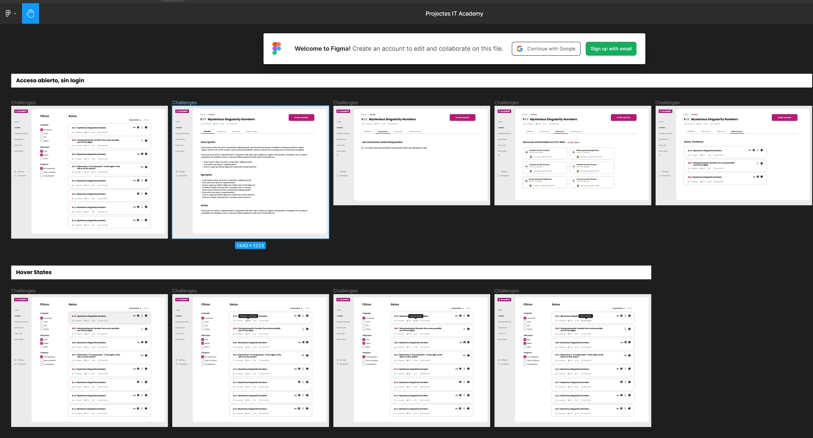

# Guía de estilo de IT-Challenge

## Tabla de contenidos

1. [**ENLACES DEL PROYECTO**](#1-enlaces-del-proyecto)\
   1.1 [Enlaces del proyecto](#11-enlaces-del-proyecto)

2. [**PROCEDIMIENTOS DE TRABAJO**](#2-procedimientos-de-trabajo)\
   2.1 [Primeras tareas del proyecto](#21-primeras-tareas-del-proyecto)\
   2.2 [Configuraciones Git](#22-configuraciones-git)\
   2.3 [Procedimiento diario](#23-procedimiento-diario)\
   2.4 [Procedimiento de trabajo con tarjetas](#24-procedimiento-de-trabajo-con-tarjeta)\
   2.5 [Aspectos a tener en cuenta al hacer una PR](#25-aspectos-a-tener-en-cuenta-al-hacer-una-pr)\
   2.6 [Metodología Scrum](#26-metodología-scrum)

3. [**NORMALIZACIÓN DE URL**](#3-normalización-de-url)\
   3.1 [Convenciones](#31-convenciones)

4. [**DEFINICIONES DE MÉTODO, CLASES, ETC...**](#4-definiciones-de-método-clases-etc)\
   4.1 [Nombre de los Packages](#41-nombre-de-los-packages)\
   4.2 [Nombre de las clases](#42-nombre-de-las-clases)\
   4.2.1 [Nombre de las clases de prueba (testing)](#421-nombre-de-las-clases-de-prueba--testing-)\
   4.2.2 [Nombre de las clases de interficie](#422-nombre-de-las-clases-de-interficie)\
   4.3 [Nombre de los métodos](#43-nombre-de-los-métodos)\
   4.3.1 [Nombre de los métodos de prueba (testing)](#431-nombre-de-los-métodos-de-prueba--testing-)\
   4.4 [Nombre de constantes](#44-nombre-de-constantes)\
   4.5 [Nombres de variables locales](#45-nombre-de-variables-locales)\
   4.5.1 [Variables temporales "throwaway"](#451-variables-temporales--throwaway-)\
   4.6 [Nombres de variables de tipo](#46-nombres-de-variables-de-tipo)\
   4.7 [Camel case: definido](#47-camel-case--definido)

5. [**LIBRERÍAS USADAS**](#5-librerías-usadas)\
   5.1 [Plugins principales](#51-plugins-principales)\
   5.2 [Área de implementación](#52-área-de-implementación)\
   5.3 [Área de pruebas (testing)](#53-área-de-pruebas--testing-)

6. [**PROGRAMAS REQUERIDOS**](#6-programas-requeridos)\
   6.1 [Programas requeridos](#61-programas-requeridos)

7. [**PROGRAMAS RECOMENDADOS**](#7-programas-recomendados)\
   7.1 [Programas recomendados](#71-programas-recomendados)

----------------------------------------------------------------

# 1. ENLACES DEL PROYECTO
## 1.1 Enlaces del proyecto
- GITHUB [link](https://github.com/IT-Academy-BCN/ita-challenges-backend)\
  
- Backend Sprint Backlog [link](https://github.com/orgs/IT-Academy-BCN/projects/15/views/1)\
  
- Product Backlog [link](https://github.com/orgs/IT-Academy-BCN/projects/13/views/1?visibleFields=%5B%22Title%22%2C%22Assignees%22%2C%22Status%22%2C%22Labels%22%5D)\
  
- Figma [link](https://www.figma.com/file/ScWpDKxEB3wEGbztXMSJO3/Projectes-IT-Academy?type=design&node-id=559-2230&mode=design)\
  

----------------------------------------------------------------

# 2. PROCEDIMIENTOS DE TRABAJO

## 2.1 Primeras tareas del proyecto
### 1. Añadir tu nombre y GitHub al archivo contributors.md

1. Clona el repositorio ita-challenges-backend de GitHub en tu sistema local:

         git clone https://github.com/IT-Academy-BCN/ita-challenges-backend.git
2. Cambie al directorio del repositorio clonado:

         cd ita-challenges-backend
3. Asegúrese de estar en la rama "develop". Puede verificar las ramas diponibles y su rama actual ejecutando el siguiente comando:

         git branch
4. Si no está en la rama "develop", cambie a ella ejecutando el siguiente comando:

         git checkout develop
5. Cree una nueva rama con su nombre para realizar sus cambios:

         git checkout -b nombre-de-su-rama
   Remplace "nombre-de-su-rama" con un nombre descriptivo que indique los cambios que planea realizar.

6. Abra el archivo contributors.md y agregue su nombre y su GitHub.

7. Después de hacer un git add y un git commit, realize el siguiente git push:

         git push origin nombre-de-su-rama
8. Abra el repositorio en GitHub y debería ver un mensaje que le permite crear un "pull request" desde su rama recién creada a la rama "develop". Haga clic en el enlace para crear el pull request.

----------------------------------------------------------------
----------------------------------------------------------------
### 2. Importar data en MongoDB (Ejemplo para data del micro itachallenge-challenge)

1. Asegúrate de tener las MongoDB Tools instaladas. Si aún no las tienes, ve al apartado de “Programas necesarios” y sigue las instrucciones proporcionadas para descargarlas en tu sistema operativo.

2. Ahora que tienes las MongoDB Tools instaladas, abre la terminal de MongoDB ejecutando el siguiente comando:

         mongosh

3. Usa el siguiente comando para crear la base de datos "challenges":

         use challenges

4. Una vez dentro de la base de datos "challenges", pega el siguiente bloque de código:

         db.createUser({
         user: "admin_challenge",
         pwd: "BYBcMJEEWw5egRUo",
         roles: [
         { role: "dbOwner", db: "challenges" }
         ]
         });

5. Ejecuta el siguiente comando para ver si el usuario se ha creado correctamente:

         show users
6. Sal de la terminal de MongoDB escribiendo el siguiente comando:

         exit

7. Mueve el archivo load-data de la carpeta monogdb.init a la carpeta mongodb-test-data.
   Si estás utilizando Windows, utiliza el archivo .bat, en cambio, si estás utilizando Mac o Linux, el archivo es .sh.

8. En la terminal normal, navega a la carpeta mongodb-test-data utilizando el comando cd.

9. Para importar el documento, ejecuta el siguiente comando:

   · En Windows:

         load-data.bat

   · En Mac o Linux:

         ./load-data.sh

   Si recibes un mensaje de permiso denegado, otorga permisos de ejecución al archivo con el siguiente comando:

         chmod +x load-data.sh

10. Luego, mueve el archivo load-data.bat o load-data.sh de vuelta a su carpeta original, mongodb.init.

11. Abre MongoDB Compass, haz un "Reload Data" y ya verás la base de datos correctamente importada.

----------------------------------------------------------------
----------------------------------------------------------------
## 2.2 Configuraciones Git

Configuraciones Git necesarias para evitar problemas

### 2.2.1 Git ignore
1. Copie el archivo ".gitignore" del proyecto raíz\
   
2. Péguelo en el directorio del PC (fuera de la carpeta del proyecto)
3. En Git Bash...
4. Ejecute el comando: 'git config --global core-excludesfile ruta/.gitignore'\
   Where...\
   'Path': es la ruta de la carpeta donde se encuentra el archivo ".gitignore".\
   ¡Nota! Esta configuración no solo te servirá para el proyecto actual, sino también para todos los proyectos que hagas con GIT.

### 2.2.2 Autocrlf
Si tiene un problema con una PR que modifica muchos archivos, >100, debe hacer lo siguiente ...
1. En Git Bash...
2. Ejecute el comando: 'git config --global core.autocrlf true'

----------------------------------------------------------------
----------------------------------------------------------------
## 2.3 Procedimiento diario
1. Conectarse a Teams a las 9:15h
2. Hacer pull de la rama "develop"
3. Hacer merge de develop con la rama en la que estás trabajando
4. "Coffee time" a las 10:15h aproximadamente

IMPORTANTE: Se espera que en proyecto estemos online con cámara encendida desde las 9:15h hasta las 13:15h, para trabajar en equipo (salvo circunstancias que lo justifiquen).

----------------------------------------------------------------
----------------------------------------------------------------
## 2.4 Procedimiento de trabajo con tarjeta
### Como asignarse una tarjeta
1. En el tablero de Spring Backlog, localiza la tarjeta que deseas asignarte.
2. Haz clic en la tarjeta para abrirla y ver más detalles.
3. En la parte de la derecha, en el campo "Assigness", si aprietas "Add assigness" se abre un desplegable con todos los participantes del proyecto y ya te puedes seleccionar a ti para asignártela.
4. Una vez que te has asignado la tarjeta, tu perfil de usuario se mostrará como el responsable de la tarjeta.

### Sistema de columnas para organizar y visualizar el progreso de las tarjetas
1. Te puedes asignar cualquier tarjeta que esté en la columna "Todo" siempre y cuando esté libre.
2. Cuando empieces a trabajar con la tarjeta, la deberás mover a la columna "Doing".
3. Cuando la tarea de la tarjeta haya sido completada y hayas hecho la PR a la rama "develop", puedes mover la tarjeta a la columna "Testing" para indicar que ya está lista para ser probada.
4. Finalmente, cuando tu PR haya sido aceptada y, por lo tanto, la tarjeta haya sido aprobada en las pruebas, esta se pasará a la columna "Done". Esto indica que la tarjeta se ha completado con éxito.

### Ya tengo una targeta asignada. ¿Ahora que hago?
1. Abre tu terminal o línea de comandos y navega hasta el directorio de tu proyecto. Asegúrate de estar en la rama "develop".

2. Crea una nueva rama utilizando el formato "feature#numeroDeLaTarjeta". Se refiere al número de la tarjeta del Spring Backlog. Por ejemplo:

         git checkout -b feature#123
3. Ahora puedes comenzar a realizar los cambios en tu rama.

4. Una vez hayas realizado las modificaciones necesarias haz un push de tu rama al repositorio remoto. Si estuviésemos en la feature#123 deberíamos hacer:

         git push origin feature#123

5. Finalmente, ve a GitHub donde se encuentra tu repositorio y crea un "pull request" desde tu rama "feature#123" hacia la rama "develop".

----------------------------------------------------------------
----------------------------------------------------------------
## 2.5 Aspectos a tener en cuenta al hacer una PR
1. En la página de creación de a pull request, selecciona la rama base y la rama comparada:
    - La rama base es la rama a la que deseas fusionar tus cambios. En este caso es la rama "develop".
    - La rama comparada es la rama que contiene tus cambios.
2. Proporciona una descripción de los cambios que has realizado. Sé claro y conciso.
3. Cuando hayas terminado de completar la información de la pull request, haz clic en el botón verde "Create pull request" para crearla.
4. A continuación verás como se hace un análisis del build. Si el análisis pasa con éxito, se mostrará un tick verde en el resultado. Por el contrario, si detecta problemas en el código, se mostrará una aspa roja. En este caso, aprieta en "Details" y observa donde se encuentra el problema.
5. SonarCloud también va a analizar tu código. Te proporcionará información sobre los bugs, vulnerabilities, security hotspots y code smell. El converage debe ser igual o superior al 80.0%.
6. En caso de que debas revisar y corregir algunos problemas, actualiza tu rama local con los cambios y haz push nuevamente a la rama remota correspondiente.
7. La pull request se actualizará automáticamente con los nuevos cambios realizados en tu rama.

----------------------------------------------------------------
----------------------------------------------------------------
## 2.6 Metodología Scrum
https://scrumguides.org/

----------------------------------------------------------------

# 3. NORMALIZACIÓN DE URL
En este proyecto, es importante seguir ciertas convenciones al establecer la estructura y nomenclatura de las URL's utilizadas en el backend.

## 3.1 Convenciones

A continuación, se presentan las convenciones que deben seguirse al normalizar las URL's:

- **Pluralización**: se recomienda utilizar nombres plurales para los recursos en las URL's. Por ejemplo, en lugar de "/challenge", se utilizaría "/challenges".

- **Uso de sustantivos**: se deben utilizar sustantivos en lugar de verbos en los nombres de los recursos para mantener una estructura coherente. Por ejemplo, "/challenges" en lugar de "/obtener-challenges".

- **Separadores**: se ha establecido el uso de guiones ("-") como separador para las palabras en las URL's. Por ejemplo, "/bcn-zones"

- **Consistencia en minúsculas**: las URL's deben seguir una convención de minúsculas. Por ejemplo, "/challenges" en minúsculas en lugar de "/Challenges" o "/CHALLENGES".

- **Evitar caracteres especiales**: se deben evitar los caracteres especiales en las URL's y, en su lugar, utilizar caracteres alfanuméricos.

- **Orden jerárquico**: si hay una jerarquía en los recursos, se debe reflejar en la estructura de las URL's. Por ejemplo, "/challenges/{challengeId}/update" para obtener los desafios del usuario.

- **Versionado**: si se requiere versionar la API, se debe considerar incluir la versión en la URL. Por ejemplo, "/itachallenge/api/v1/challenge" para la versión 1 de la API de challenges.

- **Evitar verbos en URL's**: en general, se recomienda evitar incluir verbos en las URL's y utilizar los métodos HTTP adecuados para realizar acciones en los recursos.

- **Consistencia con nombres de atributos**: los nombres de atributos utilizados en las URL's deben ser coherentes con los nombres utilizados en el modelo de datos.

- **Evitar URL's demasiado largas**: se debe evitar el uso de URL's excesivamente largas y buscar mantenerlas concisas y significativas.

## Ejemplos

Aquí se presentan algunos ejemplos de cómo deben estructurarse las URL's según las convenciones establecidas:

- `/challenges` - Obtener una lista de todos los challenges.
- `/challenges/{challengeId}` - Obtener los detalles del challenge con ID 550e8400-e29b-41d4-a716-446655440000.
- `/challenges/{challengeId}/update` - Editar los detalles del challenge con ID 550e8400-e29b-41d4-a716-446655440000.

----------------------------------------------------------------

# 4. DEFINICIONES DE MÉTODO, CLASES, ETC...

## 4.1 Nombre de los Packages
#### NORMAS
    - Todo en minúscula
    - Sólo letras y dígitos

#### EJEMPLO
    - com.itachallenge.user
    - exception
    - helper

### LINKS
[Oracle Code Conventions for java: 9 - Naming Conventions](https://www.oracle.com/java/technologies/javase/codeconventions-namingconventions.html)\
[Google Java Style Guide: 5.2.1 package names](https://google.github.io/styleguide/javaguide.html#s5.2.1-package-names)

----------------------------------------------------------------
----------------------------------------------------------------
## 4.2 Nombre de las clases
#### NORMAS
    - UpperCamelCase
    - Sólo letras y dígitos

#### EJEMPLO
    - UserController
    - PropertiesConfig

#### LINKS
[Oracle Code Conventions for java: 9 - Naming Conventions](https://www.oracle.com/java/technologies/javase/codeconventions-namingconventions.html)\
[Google Java Style Guide: 5.2.2 class names](https://google.github.io/styleguide/javaguide.html#s5.2.2-class-names)

### 4.2.1 Nombre de las clases de prueba (testing)
#### NORMAS
    - UpperCamelCase
    - Terminar con 'Test'
    - Sólo letras y dígitos

#### EJEMPLOS
    - ChallengeControllerTest
    - ResourceHelperTest

#### LINKS
[Oracle Code Conventions for java: 9 - Naming Conventions](https://www.oracle.com/java/technologies/javase/codeconventions-namingconventions.html)\
[Google Java Style Guide: 5.2.2 class names](https://google.github.io/styleguide/javaguide.html#s5.2.2-class-names)

### 4.2.2 Nombre de las clases de interficie
#### NORMAS
    - UpperCamelCase
    - Sólo letras y dígitos

----------------------------------------------------------------
----------------------------------------------------------------
## 4.3 Nombre de los métodos
#### NORMAS
    - lowerCamelCase 
    - Sólo letras y dígitos

#### EJEMPLO
    - isValidUUID
    - initReactorHttpClient

#### LINKS
[Oracle Code Conventions for java: 9 - Naming Conventions](https://www.oracle.com/java/technologies/javase/codeconventions-namingconventions.html)\
[Google Java Style Guide: 5.2.3 method names](https://google.github.io/styleguide/javaguide.html#s5.2.3-method-names)

## 4.3.1 Nombre de los métodos de prueba (testing)
#### NORMAS
    - lowerCamelCase
    - Sólo letras y dígitos
    - Terminar con '_test'

#### EJEMPLO
    - getChallengeId_test
    - findAll_test

#### LINKS
[Oracle Code Conventions for java: 9 - Naming Conventions](https://www.oracle.com/java/technologies/javase/codeconventions-namingconventions.html)\
[Google Java Style Guide: 5.2.3 method names](https://google.github.io/styleguide/javaguide.html#s5.2.3-method-names)

----------------------------------------------------------------
----------------------------------------------------------------
## 4.4 Nombre de constantes
#### NORMAS
    - Mayúsculas
    - Sólo letras y dígitos
    - Palabra separada con un solo guión bajo '_'

#### EJEMPLO
    - static final int BEST_YEAR = 1977;
    - static final String BEST_MONTH = "February";

#### LINKS
[Oracle Code Conventions for java: 9 - Naming Conventions](https://www.oracle.com/java/technologies/javase/codeconventions-namingconventions.html)\
[Google Java Style Guide: 5.2.4 constant names](https://google.github.io/styleguide/javaguide.html#s5.2.4-constant-names)

----------------------------------------------------------------
----------------------------------------------------------------
## 4.5 Nombre de variables locales
#### NORMAS
    - lowerCamelCase
    - Comienza con letra
    - Los nombres de las variables deben ser breves pero significativos.  

#### EJEMPLO
    - int year = 1977;
    - static final String BEST_MONTH = "February";

#### LINKS
[Oracle Code Conventions for java: 9 - Naming Conventions](https://www.oracle.com/java/technologies/javase/codeconventions-namingconventions.html)\
[Google Java Style Guide: 5.2.4 constant names](https://google.github.io/styleguide/javaguide.html#s5.2.4-constant-names)

### 4.5.1 Variables temporales "throwaway"
#### NORMAS
    - Only use for temporary "throwaway" variables
    - Minúscula

#### EJEMPLO
    - int   => i, j, k, m and n
    - char  => c, d and e

#### LINKS
[Oracle Code Conventions for java: 9 - Naming Conventions](https://www.oracle.com/java/technologies/javase/codeconventions-namingconventions.html)

----------------------------------------------------------------
----------------------------------------------------------------
## 4.6 Nombres de variables de tipo
#### NORMAS
    - Una sola letra mayúscula, opcionalmente seguida de un solo número
    - Un nombre en la forma utilizada para las clases

#### EJEMPLO
    - E, T, X, T2
    - RequestT, ChallengeT

#### LINKS
[Google Java Style Guide: 5.2.8 Type variable names](https://google.github.io/styleguide/javaguide.html#s5.2.8-type-variable-names)

----------------------------------------------------------------
----------------------------------------------------------------
## 4.7 Camel case: definido
#### NORMAS
    - Sólo letras y dígitos
    - UpperCamelCase
        - Cada primera letra de cada palabra es letra mayúscula
    - lowerCamelCase
        - La primera letra de cada palabra está en minúscula, excepto la primera palabra que comienza
           con una letra minúscula 

#### EJEMPLO
    - UpperCamelCase
        - UserController
        - ChallengeService
    - lowerCamelCase 
        - creationDate
        - validUUID

#### LINKS
[Google Java Style Guide: 5.3 Camel case defined](https://google.github.io/styleguide/javaguide.html#s5.3-camel-case)

----------------------------------------------------------------
# 5. LIBRERÍAS USADAS

## 5.1 Plugins principales
- 'java'
    - 'org.springframework.boot' version '3.0.6'
- 'jacoco'
    - 'org.sonarqube' version '4.0.0.2929'

## 5.2 Área de implementación

- BOOTSTRAP
    - Versión 4.0.2
    - group: 'org.springframework.cloud', name: 'spring-cloud-starter-bootstrap', version: '4.0.2'

- COMMONS IO
    - Versión 2.11.0
    - 'commons-io:commons-io:2.11.0'
- COMMONS LANG
    - Versión 3.12.0
    - 'org.apache.commons:commons-lang3:3.12.0'
- COMMONS VALIDATOR
    - Versión 1.7
    - 'commons-validator:commons-validator:1.7'
- CONSUL CONFIG
    - Versión 4.0.2
    - 'org.springframework.cloud:spring-cloud-starter-consul-config:4.0.2'
- CONSUL DISCOVERY
    - Versión 4.0.2
    - 'org.springframework.cloud:spring-cloud-starter-consul-discovery:4.0.2'
- PROJECTLOMBOK
    - Versión 1.18.26
    - 'org.projectlombok:lombok:1.18.26'
- SPRING CONTEXT
    - Versión 3
    - 'org.springframework:spring-context:5.3.13'
- SPRING BOOT AUTOCONFIGURE
    -  Versión 3.0.6
    - 'org.springframework.boot:spring-boot-autoconfigure:3.0.6'
- SPRING BOOT CLOUD COMMONS
    - Versión 4.0.1
    - 'org.springframework.cloud:spring-cloud-commons:4.0.1'
- SPRING BOOT STARTER ACTUATOR
    - Versión 3.0.6
    - 'org.springframework.boot:spring-boot-starter-actuator:3.0.6'
- SPRING BOOT STARTER DATA MONGODB
    - Versión 3.0.6
    - 'org.springframework.boot:spring-boot-starter-data-mongodb:3.0.6'
- SPRING BOOT STARTER DATA MONGODB REACTIVE
    - Versión 3.0.6
    - 'org.springframework.boot:spring-boot-starter-data-mongodb-reactive:3.0.6'
- SPRING BOOT STARTER WEB
    - Versión 3.0.6
    - 'org.springframework.boot:spring-boot-starter-web:3.0.6'
- SPRING BOOT STARTER WEBFLUX
    - Versión 3.0.6
    - 'org.springframework.boot:spring-boot-starter-webflux:3.0.6'
- SPRINGDOC OPENAPI
    - Versión 2.1.0
    - 'org.springdoc:springdoc-openapi-starter-webmvc-ui:2.1.0'

## 5.3 Área de pruebas (testing)

- ASSERTJ
    - Versión 3.24.2
    - 'org.assertj:assertj-core:3.24.2'
- SPRING
    - Versión 5.3.13
    - 'org.springframework:spring-test:5.3.13'
- HAMCREST
    - Versión 2.2
    - 'org.hamcrest:hamcrest:2.2'
- JUNIT
    - 'org.junit.jupiter:junit-jupiter'
- JUNIT JUPITER
    - Versión 1.17.6
    - 'org.testcontainers:junit-jupiter:1.17.6'
- JUNIT PLATAFORM SUITE
    - Versión 1.8.1
    - 'org.junit.platform:junit-platform-suite-engine:1.8.1'
- MOCKITO
    - Versión 5.3.1
    - 'org.mockito:mockito-core:5.3.1'
- MOCK WEBSERVER
    - Versión 4.9.3
    - 'com.squareup.okhttp3:mockwebserver:4.9.3'
- MONGODB
    - Versión 1.17.6
    - 'org.testcontainers:mongodb:1.17.6'
- PROJECT REACTOR
    - Versión 3.1.0 Release
    - 'io.projectreactor:reactor-test:3.1.0.RELEASE'
- SPRING BOOT STARTER TEST
    - Versión 3.06
    - 'org.springframework.boot:spring-boot-starter-test:3.0.6'

----------------------------------------------------------------

# 6. PROGRAMAS REQUERIDOS
Los siguientes programas son requeridos para poder trabajar en el proyecto:

## 6.1 Programas requeridos

- **MongoDB**: MongoDB es una base de datos NoSQL ampliamente utilizada en el desarrollo de aplicaciones. Se utiliza para almacenar y recuperar datos de forma eficiente. Puedes descargar [MongoCompass](https://www.mongodb.com/try/download/compass) desde la web oficial.

- **Postman**: Postman es una herramienta que te permitirá probar y documentar las API de forma sencilla. Es especialmente útil para enviar solicitudes HTTP y verificar las respuestas. Puedes descargar [Postman](https://www.postman.com/downloads/) desde la web oficial.

- **Consul**: Consul es una herramienta de descubrimiento y configuración de servicios. Se utiliza para gestionar la comunicación entre diferentes componentes de la aplicación. Puedes descargar [Consul](https://developer.hashicorp.com/consul/downloads) desde la web oficial.

- **Docker**: Docker es una plataforma que permite empaquetar y distribuir aplicaciones en contenedores. Proporciona un entorno aislado para ejecutar la aplicación y sus dependencias. Puedes descargar [Docker](https://www.docker.com/products/docker-desktop/) desde la web oficial.

- **Git**: Git es un sistema de control de versiones distribuido ampliamente utilizado en el desarrollo de software. Te permitirá colaborar con otros desarrolladores y mantener un historial de cambios en el código fuente. Puedes descargar [Git](https://git-scm.com/downloads) desde la web oficial.

- **Java SE Development Kit 17.0.7**: Java SE Development Kit (JDK) es un conjunto de herramientas necesarias para desarrollar aplicaciones en Java. Asegúrate de tener instalada la versión 17.0.7 del JDK que es la que se usa en este proyecto. Puedes descargar [JDK 17](https://www.oracle.com/java/technologies/javase/jdk17-archive-downloads.html) desde la web oficial de Oracle.

Es importante asegurarse de tener todas estas herramientas instaladas y configuradas correctamente antes de comenzar a trabajar en el proyecto.

----------------------------------------------------------------
# 7 PROGRAMAS RECOMENDADOS

Los siguientes programas son recomendables para facilitar el trabajo en el proyecto:

## 7.1 Programas recomendados

- **Mongo Tools**: Mongo Tools es un conjunto de utilidades de línea de comandos para trabajar con MongoDB. Proporciona herramientas adicionales para importar y exportar datos, entre otras tareas. Puedes descargar [MongoDB Command Line Database Tools](https://www.mongodb.com/try/download/database-tools) desde la web oficial.

- **Mongo Shell**: Mongo Shell es una interfaz de línea de comandos para MongoDB. Proporciona una forma interactiva de interactuar con la base de datos, ejecutar consultas y administrar colecciones. Puedes descargar [MongoDB Shell](https://www.mongodb.com/try/download/shell) desde la web oficial.

- **IntelliJ IDEA**: IntelliJ IDEA es un entorno de desarrollo integrado (IDE) muy utilizado en el desarrollo de aplicaciones Java y otros lenguajes de programación. Puedes descargar [IntelliJ IDEA](https://www.jetbrains.com/es-es/idea/download/?section=windows) desde la web oficial.

- **Plugin SonarLint para IntelliJ IDEA**: SonarLint es una herramienta de análisis estático de código que te ayudará a identificar y corregir problemas de calidad en tu código. Es una ayuda útil para detectar Code Smell. Puedes obtener más información de [SonarLint](https://plugins.jetbrains.com/plugin/7973-sonarlint) desde la web ofical de Jetbrains.

Recuerda que estos programas o plugins son recomendados, pero no son obligatorios. Utilizarlos puede mejorar tu productividad y la calidad del código, pero puedes optar por otras alternativas según tus preferencias y necesidades.
