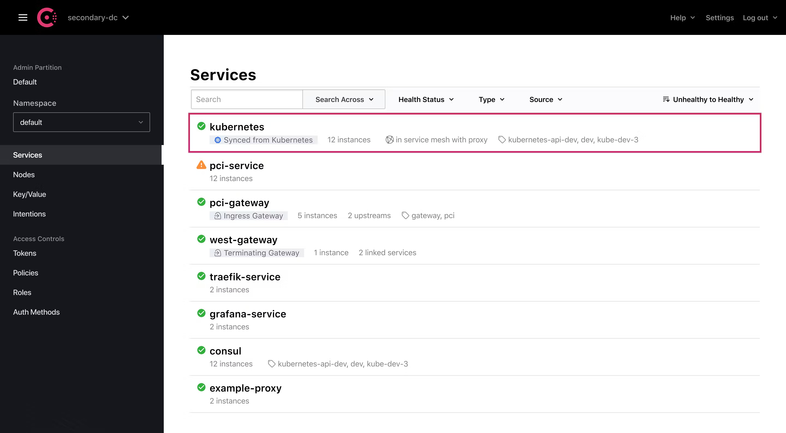

## Trabajo con contenedores & Consul

### Inicialización de contenedores

#### Creación de imágenes de cada microservicio
```
./build_Docker.sh
```
#### MongoDB

La configuración para la inicialización de la base de datos Mongo está incluida en docker-compose.yml

##### Comandos Docker 

- Arranque instancia MongoDB (desde directorio raíz, versión en docker-compose.yml):
```
docker compose up -d itachallenge-mongodb
```

- Entrar en contenedor accediendo a consola bash (para conectar por consola Mongo shell, p.ej.):
```
docker exec -it [containerID] bash
```

- Verificación de inicialización Mongo (desde dentro del contenedor): ejecutar desde cmd
```
mongosh --username [user] --password [pwd]  --authenticationDatabase [dbUsers] [dbUsers] --eval "db.adminCommand({ listDatabases: 1 })"
```

- Verificación de inicialización Mongo (desde fuera del contenedor):

```
docker exec -it [containerID] mongosh --username admin_itachallenge --password [password]  --authenticationDatabase [dbUsers] [dbUsers] --eval "db.adminCommand({ listDatabases: 1 })"
```

## Consul


#### Arranque de Consul

- Arrancar Docker en la máquina (UNIX based)
```
sudo systemctl start docker 
```
- Descargar imagen Docker. Véase [documentación oficial](https://hub.docker.com/_/consul).
```
docker pull consul
```

- Arrancar cluster consul (desde directorio raíz)
```
docker compose -f consul/docker-compose.yml up --remove-orphans consul-server1 consul-server2 consul-server3
```

- http://localhost:8500 debe mostrar consola de Administración Consul 




